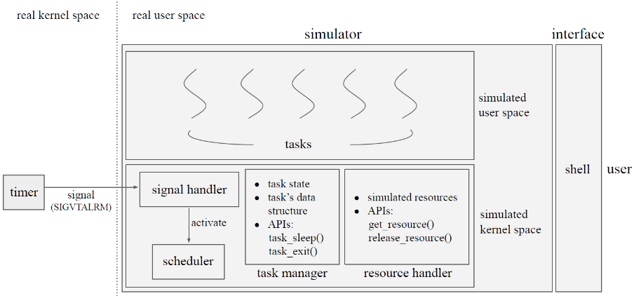
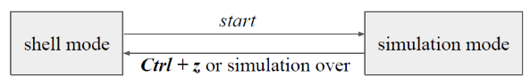
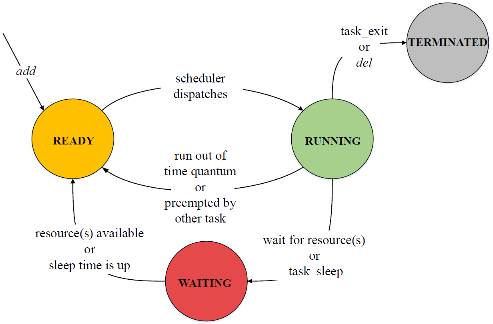

# Scheduler Simulator Specification

## Objective
- Understand how to implement user-level thread scheduling
- Understand how signal works in Linux
- Understand how scheduling algorithms affect results

⚠️ Note: In this project, we won't use the pthread library (the pthread library is managed by the kernel); instead, threads will be managed by the user.


## Architecture



## Requirement (1/5) -- Tasks & task manager
- Use **`ucontext` and the related APIs** to **create tasks**
- Each task runs a function defined in `function.c`, **and should not be modified**
- Implement a task manager to manage tasks, including their state, data structures and so on
- Implement task state-related APIs that can be used by the tasks
    - `void task_sleep(int msec_10);`
    - `void task_exit();`

## Requirement (2/5) -- Task scheduler
- Use **`ucontext` and the related APIs** to do **context switch**
- Implement three scheduling algorithms
    - FCFS
    - RR with time quantum = 30 (ms)
    - priority-based preemptive scheduling, smallest integer → highest priority
- The algorithm is determined at execution: `./scheduler_simulator {algorithm}`
    - `algorithm` can be `FCFS`, `RR`, `PP` or `all`
- Once the scheduler dispatches CPU to a task, print a message in the format:
```
Task {task_name} is running.
```
- If there are no tasks to be scheduled, but there are still tasks waiting, print a message in the format:
```
CPU idle.
```
⭐ 也就是 Ready Queue 中沒有 process，但是 Waiting Queue 中有 process


## Requirement (3/5) -- Resource handler
- Implement resource-related APIs that can be used by the task
    - i. `void get_resource(int count, int *resource_list);`
    - ii. `void release_resource(int count, int *resource_list);`
- There should be **8 resources with id 0-7** in the simulation.
- How to simulate resources is up to your design. For example, you can use a boolean array,
```
resource_available = { true, false, true, .... }
```

## Requirement (4/5) -- Timer & Signal handler
- Use related system calls to **set a timer** that should **send a signal (`SIGVTALRM`) every 10 ms**
- The signal handler should do the followings:
    - i. Calculate all task-related time (granularity: 10ms)
    - ii. Check if any tasks' state needs to be switched
    - iii. Decide whether re-scheduling is needed

## Requirement (5/5) -- Command line interface



- Use provided shell as the simulator’s CLI
- Should support four more commands
    - i. `add`: Add a new task
    - ii. `del`: Delete a existing task
    - iii. `ps`: Show the information of all tasks, including:
        - TID
        - task name
        - task state
        - running time
        - waiting time
        - turnaround time
        - resources occupied and priority (if any)
    - iv. `start`: Start or resume simulation
- **Ctrl + z** should **pause the simulation** and **switch to shell mode**
- **Timer should stop in the shell mode** and **resume when the simulation resumes**
- When the simulation is over, switch back to shell mode after printing a message in the format:
```
Simulation over.
```

# API Description
## `task_sleep()`
```c
void task_sleep(int msec_10);
```
Print a message in the format:
```
Task {task_name} goes to sleep.
```
- This task will be switched to **WAITING state**
- After `10 * msec_10` ms, this task will be switched to **READY state**

## `task_exit()`
```c
void task_exit();
```
Print a message in the format:
```
Task {task_name} has terminated.
```
- This task will be switched to **TERMINATED state**

## `get_resource()`
```c
void get_resource(int count, int *resource_list);
```
- Check if all resources in the list are available
- If yes
    - Get the resource(s)
    - Print a message for each resource in the list in the format:
    ```
    Task {task_name} gets resource {resource_id}.
    ```
- If no
    - This task will be switched to **WAITING state**
    - Print a message in the format:
    ```
    Task {task_name} is waiting resource.
    ```
- When all resources in the list are available, this task will be switched to **READY state**
- Check again when CPU is dispatched to this task

⭐ Check again 指的是重新執行一次 `get_resource()`

Q: 為何 all resources in the list are available 後，且進到 Ready state 後，還要重新執行一次 `get_resource()`?
A: 因為進到 Ready State，不代表已經取得 CPU 了，有可能當 task 取得 CPU 時，resource 又變成 not available 了。

## `release_resource()`
```c
void release_resource(int count, int *resource_list);
```
- Release the resource(s)
- Print a message for each resource in the list in the format:
```
Task {task_name} releases resource {resource_id}.
```

# Shell Command
## `add`
- Command format:
```
add {task_name} {function_name} {priority}
```
- Create a task named `task_name` that runs a function named `function_name`
- `priority` is ignored if the scheduling algorithm is not priority-based preemptive scheduling
- This task should be **set as READY state**
- Print a message in the format:
```
Task {task_name} is ready.
```

## `del`
- Command format:
```
del {task_name}
```
- The task named `task_name` should be switched to **TERMINATED state**
- Print a message in the format:
```
Task {task_name} is killed.
```

## `ps`
- Command format: `ps`
- Show the information of all tasks, including 
    - TID, 
    - task name, 
    - task state, 
    - running time, 
    - waiting time,
    - turnaround time, resources occupied and 
    - priority (if any)
- Example

```
 TID|  name|      state| running| waiting| turnaround| resources| priority
--------------------------------------------------------------------------
   1|    T1| TERMINATED|       1|       0|          1|      none|        1
   2|    T2|    WAITING|       1|       1|       none|     1 3 7|        2
   3|    T3|      READY|       0|       2|       none|      none|        4
   4|    T4|    RUNNING|       0|       2|       none|      none|        3
```

1. The TID of each task is unique, and TID starts from 1.
2. There is **no turnaround time for unterminated tasks.**

⚠️ Waiting Time (等待時間): process 待在 **ready queue** 中「等待取得 CPU」之等待時間加總

⚠️ Waiting Time 不包含待在 waiting queue 的時間，因為只有待在 ready queue 才可以競爭 CPU

⭐ Turnaround Time (完成時間): process 進入系統後到它完成工作的這段時間差值

⚠️ 若 process 尚未完成工作，則 Turnaround Time (完成時間) 值是不確定的，因此寫成 `none`

3. Time unit: 10ms

## `start`
- Command format: `start`
- **Start** or ***resume*** the simulation
- Print a message in the format: 
```
Start simulation.
```

# Task State Diagram



## Precautions
- You should implement this project with C language.
- You can modify `makefile` as you want, but make sure your `makefile` can compile your codes and generate the executable file correctly.
- The executable file should be named `scheduler_simulator`.

## Reference
- `ucontext`
    - [The Open Group Library](https://pubs.opengroup.org/onlinepubs/7908799/xsh/ucontext.h.html)
    - Linux manual page
        - [`getcontext()`](https://man7.org/linux/man-pages/man3/getcontext.3.html)
        - [`setcontext()`](https://man7.org/linux/man-pages/man3/setcontext.3.html)
        - [`makecontext()`](https://man7.org/linux/man-pages/man3/makecontext.3.html)
        - [`swapcontext()`](https://man7.org/linux/man-pages/man3/swapcontext.3.html)
- signal
    - [Gitbook](https://calvinkam.github.io/csci3150-Fall17-lab-pipes-signal/custom-signal-handler.html)
    - [Linux manual page](https://man7.org/linux/man-pages/man2/signal.2.html)
- timer
    - [Linux manual page](https://man7.org/linux/man-pages/man2/setitimer.2.html)
    - [IBM® IBM Knowledge Center](https://www.ibm.com/docs/en/i/7.3?topic=ssw_ibm_i_73/apis/setitime.html)

## Appendix - file structure of the template
```
.
├── include
│   ├── builtin.h
│   ├── command.h
│   ├── function.h
│   ├── resource.h
│   ├── shell.h
│   └── task.h
├── main.c
├── makefile
├── src
│   ├── builtin.c
│   ├── command.c
│   ├── function.c
│   ├── resource.c
│   ├── shell.c
│   └── task.c
└── test
    ├── auto_run.py
    ├── general.txt
    ├── judge_shell.py
    ├── test_case1.txt
    ├── test_case2.txt
    └── test_shell.txt
```

- `shell.h/.c`, `command.h/.c`, `builtin.h/.c` are shell-related files, and **`builtin.c` contains the four commands need to be implemented** in this assignment
- `resource.h/.c` contains resource-related APIs that need to be implemented
- `task.h/.c` contains task state-related APIs that **need to be implemented**
- `function.h/.c` contains functions run by tasks. These 2 files **cannot be modified**
- `test` folder contains all test cases, an auto-judge script `judge_shell.py` for the shell and an auto-run script `auto_run.py` for the simulation

## Appendix - how to use auto-judge and auto-run
```
test/
├── auto_run.py
├── general.txt
├── judge_shell.py
├── test_case1.txt
├── test_case2.txt
└── test_shell.txt
```

- If you need to check **whether the shell is broken** due to your modification
```
python3 test/judge_shell.py
```
- Auto-run the **scheduler simulator**
```
python3 test/auto_run.py {algorithm} {test_case}
```
- algorithm can be `FCFS`, `RR`, `PP` or `all`, where `all` will perform three rounds of simulation for all scheduling algorithms
- `test_case` can be `test/general.txt`, `test/test_case1.txt` or `test/test_case2.txt`
    - Test case files contain a list of commands separated by newlines. You can also write your own test cases, just follow the format
    - `test/general.txt` tests all requirements **except pausing**
    - `test/test_case1.txt` and `test/test_case2.txt` are test cases that **need to observe the results**
- The auto-run script will generate a file to store the simulation result, and the file name is `{test_case's file name}_{algorithm}.txt`, for example, `general_FCFS.txt`
- Auto-run script **does not support pausing with **Ctrl + z****


# 補充說明
1. 本專案的測資不存在難以定義如何處理的情境，例如：「在單次模擬中存在重複的 task name 或 priority」等
2. 本專案的測資不存在會導致結果不唯一的情況，例如：「同時有多個 tasks 要從不同 queues 回到 ready queue」等
3. 本專案的測資不存在不合法的格式或數值範圍，例如：「priority 數值大於 int 最大值」等
